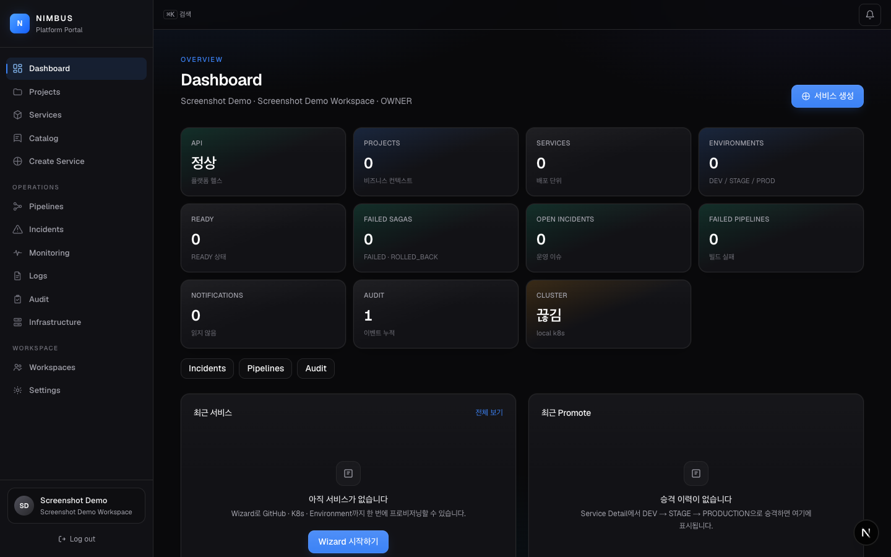
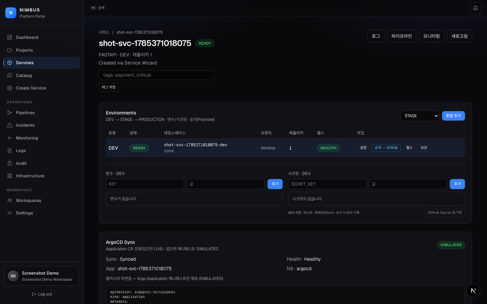
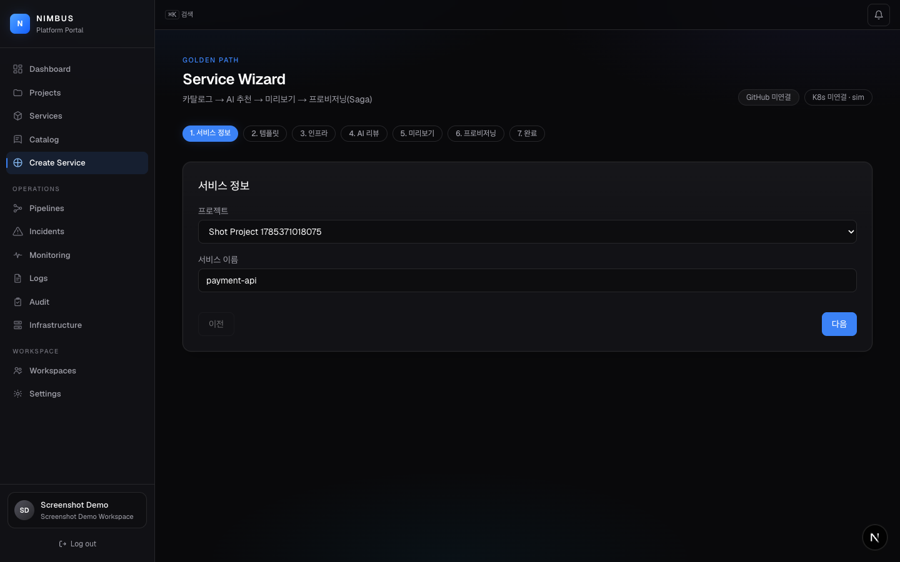
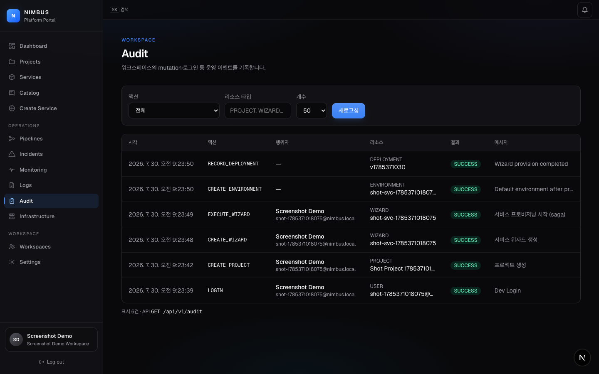

# Nimbus Platform

### AI Native Internal Developer Platform (IDP)

<p align="center">
  <strong>Kubernetes · Helm · Terraform을 몰라도<br/>
  Catalog → AI 추천 → GitHub Repo → GitOps 파일 → 배포 흐름까지<br/>
  한 포털에서 끝내는 Platform Engineering Portal</strong>
</p>

<p align="center">
  
  
  
  
</p>

<p align="center">
  
  
  
  
  
  
  
  
</p>

| | |
|---|---|
| **Version** | 0.x — 시연 MVP 완료 · 운영 기능 확장됨 |
| **Repo** | https://github.com/jinhgit/nimbus-platform |
| **PRD** | [docs/prd/PRD-MASTER.md](docs/prd/PRD-MASTER.md) |
| **구현 현황** | [docs/status/PRD-vs-Implementation.md](docs/status/PRD-vs-Implementation.md) |
| **시연 스크립트** | [docs/demo/DEMO-SCENARIO.md](docs/demo/DEMO-SCENARIO.md) (8~12분 고정) |
| **스크린샷** | [docs/demo/screenshots/](docs/demo/screenshots/) |
| **검증** | [docs/demo/VERIFICATION.md](docs/demo/VERIFICATION.md) · `scripts/verify-demo-flow.sh` |
| **세션 핸드오프** | [docs/status/SESSION-HANDOFF.md](docs/status/SESSION-HANDOFF.md) (context switch) |

> **Backstage 클론이 아니다.**  
> Catalog + Service Wizard + AI Decision Engine + GitOps 파일 생성 + 감사 로그를  
> 하나의 **Developer Workspace**로 묶는 방향이다.

---

## 목차

1. [프로젝트 소개](#1-프로젝트-소개)
2. [왜 Nimbus인가](#2-왜-nimbus인가)
3. [시스템 아키텍처](#3-시스템-아키텍처)
4. [기술 스택](#4-기술-스택)
5. [핵심 도메인](#5-핵심-도메인)
6. [프로젝트 구조](#6-프로젝트-구조)
7. [기능 구현 현황](#7-기능-구현-현황)
8. [설치 · 빠른 시작](#8-설치--빠른-시작)
9. [Docker / Compose](#9-docker--compose)
10. [Kubernetes (로컬)](#10-kubernetes-로컬)
11. [Service Wizard 플로우](#11-service-wizard-플로우)
12. [AI Decision Engine](#12-ai-decision-engine)
13. [GitHub SCM 연동](#13-github-scm-연동)
14. [Observability](#14-observability)
15. [Audit Log (실운영 P0)](#15-audit-log-실운영-p0)
16. [Frontend Portal](#16-frontend-portal)
17. [Backend API 개요](#17-backend-api-개요)
18. [보안](#18-보안)
19. [실운영 프로필](#19-실운영-프로필)
20. [면접 시연 (8~12분)](#20-면접-시연-812분)
21. [테스트 · 검증](#21-테스트--검증)
22. [개발 로드맵](#22-개발-로드맵)
23. [Free-only 제약](#23-free-only-제약)
24. [문서 링크](#24-문서-링크)
25. [커밋 컨벤션](#25-커밋-컨벤션)
26. [라이선스](#26-라이선스)

---

## 1. 프로젝트 소개

**Nimbus Platform**은 상용 클라우드 콘솔이 아니라,  
개발자가 **클릭 몇 번으로 서비스를 표준 경로(Golden Path)로 생성·배포**하는  
**AI Native Internal Developer Platform** 이다.

| 영역 | 무엇을 하는가 | 상태 |
|------|---------------|:----:|
| Auth / Workspace / RBAC | Dev Login · GitHub OAuth · JWT · VIEWER 차단 | ✅ |
| Project / Service | CRUD · Archive/Clone · Tags | ✅ |
| Service Catalog | 목록 + Blueprint/Helm/TF 상세 | ✅ |
| Service Wizard | 7단계 · Saga · Retry | ✅ |
| AI | Recommend · Review · YAML Explain · Ollama 옵션 | ✅ |
| GitHub SCM | OAuth/PAT · Repo · Actions thin | 🔶 |
| Environment · Promote · Secrets | DEV→STAGE→PROD · AES · Rotation · GH Sync thin | ✅ |
| Argo / GitOps | Application 매니페스트 · Sync thin LIVE/SIM | 🔶~✅ |
| Pipeline · Incident · Notification | 시뮬 빌드 · 이슈 스캔 · 벨 알림 | ✅ |
| Audit · Dashboard | mutation 감사 · ops 위젯 | ✅ |
| Kubernetes (로컬) | k3d/kind 경로 (시연, 로컬 마감 보류 가능) | 🔶 |
| Monitoring / Logs | Prom/Grafana 링크 · demo 메트릭 | 🔶 |

> **웹 서비스가 목적이 아니다.**  
> **Platform을 설계·명세·구현·고도화하는 역량**을 증명하는 포트폴리오 제품이다.

| 항목 | 내용 |
|------|------|
| **제품 유형** | Internal Developer Platform / Platform Engineering Portal |
| **포지션** | Platform · Backend · DevOps · SRE 포트폴리오 |
| **호스팅** | 로컬 monorepo · Compose · (선택) k3d/kind |
| **비용** | **완전 무료 (Free-only)** — 과금 클라우드·유료 LLM 없음 |
| **문서** | PRD v1.1~v1.5 + API Spec + Architecture + 구현 매트릭스 |

---

## 2. 왜 Nimbus인가

새 서비스마다 반복되는 일:

```text
Repo · Dockerfile · Actions · Helm · Manifest · Namespace · Ingress · Monitoring …
```

숙련 DevOps에게는 익숙하지만, 앱 개발자·신입에게는 비용이 크다.  
Nimbus는 그 경로를 **Catalog + Wizard + AI + Provision** 으로 줄인다.

| 구분 | 일반적인 실습 | Nimbus |
|------|----------------|--------|
| 목표 | 스택 나열 · 인프라 구축 | **플랫폼 제품** 설계·구현 |
| UX | 터미널 / YAML 직접 작성 | **Self-Service Wizard** |
| 표준 | 팀마다 제각각 | **Catalog Golden Path** |
| 판단 | 경험 의존 | **AI Decision Engine** (Confidence/Reason) |
| 배포 | 수동 kubectl | **GitOps 파일 생성 + 로컬/실운영 경로** |
| 운영 | 로그 없음 | **Audit · Monitoring · Pipeline** |
| 성장 | 일회성 데모 | **PRD 축적 → TVP → 실운영 풀스택** |

### 면접용 한 문장

> 개발자가 버튼 한 번만 누르면 GitHub 저장소 생성부터 Kubernetes 배포 흐름까지  
> 자동으로 이루어지는 **Platform Engineering Portal** 을 직접 설계·구현했습니다.

---

## 3. 시스템 아키텍처

```text
┌─────────────────────────────────────────────────────────────────┐
│                     Developer (Browser)                          │
│              Next.js 15 Portal  (:3000)                          │
│   Dashboard · Catalog · Wizard · Services · Pipelines · Audit    │
└────────────────────────────┬────────────────────────────────────┘
                             │  REST  /api/v1/*
                             ▼
┌─────────────────────────────────────────────────────────────────┐
│              Spring Boot 4 Platform API  (:8080)                 │
│  Auth · Workspace · Project · Service · Catalog · Wizard         │
│  AI · GitHub Adapter · Provision · Pipeline · K8s · Audit        │
│  Observability Facade · JWT Security · ApiResponse envelope      │
└───┬──────────┬──────────┬──────────┬──────────┬─────────────────┘
    │          │          │          │          │
    ▼          ▼          ▼          ▼          ▼
 PostgreSQL  Redis    GitHub API   k3d/kind   Prometheus
 (or H2)   (optional)  OAuth/PAT   (optional) Grafana (opt)
    │
    └── Ollama (optional AI provider) · ArgoCD manifests (file-level)
```

### 설계 원칙

1. **브라우저는 인프라에 직접 붙지 않는다** — Docker sock / kubeconfig / GitHub token 은 API 경유.
2. **Deploy unit = Service** — Project는 비즈니스 컨텍스트, 실제 배포 단위는 Service.
3. **Wizard = 입력 + AI + Preview + 비동기 Provision Job**.
4. **GitOps first** — 직접 난잡한 apply보다 파일(Helm/TF/Argo) 생성·표준 경로를 우선.
5. **AI는 Chatbot이 아니라 Decision Engine** — Confidence · Reason · Guardrail 여지.
6. **Free-only 기본 경로** — 과금 없이 재현 가능한 구현체, 인터페이스는 확장 가능.
7. **실운영 경로 분리** — `application-local` (H2 시연) / `application-prod` (Postgres 필수).

상세: [docs/architecture/00-System-Overview.md](docs/architecture/00-System-Overview.md) ·  
[docs/architecture/03-Canonical-Decisions.md](docs/architecture/03-Canonical-Decisions.md)

---

## 4. 기술 스택

| Layer | Stack |
|-------|--------|
| **Frontend** | Next.js 15, React 19, TypeScript, Tailwind CSS v4, App Router |
| **Backend** | Java 21, Spring Boot **4.0.7**, Security, JPA, Validation, Actuator |
| **Auth** | JWT (access) + refresh store · Dev Login · GitHub OAuth |
| **Data** | PostgreSQL 16 · H2 (local) · Redis 7 (optional / in-memory fallback) |
| **Jobs** | Spring `@Async` (MVP) — 이후 큐 확장 여지 |
| **SCM** | GitHub OAuth SCM + PAT · `GitProvider` 추상화 |
| **K8s** | fabric8 kubernetes-client · k3d / kind (strict-local) |
| **Infra as files** | Helm values · Terraform vars · GitHub Actions · Argo Application |
| **AI** | Rule-based Decision Engine (기본) · Ollama 확장 포인트 |
| **Observability** | Micrometer Prometheus · Compose Prom/Grafana · 로그 스냅샷/SSE |
| **Security** | Soft delete · AES 토큰 암호화 · Audit Log · CORS |

---

## 5. 핵심 도메인

```text
Workspace
  └── Project
        └── Service
              └── Environment (DEV / STAGE / PRODUCTION)   ← P1 강화
                    ├── Variable / Secret                 ← P1
                    └── Deployment / Pipeline
```

옆에 붙는 축:

| 축 | 역할 |
|----|------|
| **Catalog / Template** | 생성 입력 (Golden Path) |
| **Wizard / Provision** | 오케스트레이션 · Preview · Job |
| **AI** | 추천 · Architecture Review |
| **GitHub** | Repo · Actions · SCM 연결 |
| **Audit** | mutation 불변 기록 |
| **Monitoring / Logs** | 운영 가시성 |

Aggregate·이벤트: [docs/architecture/01-Domain-Map.md](docs/architecture/01-Domain-Map.md)

---

## 6. 프로젝트 구조

```text
nimbus-platform/
├── apps/
│   ├── api/                      # Spring Boot Platform API (io.nimbus.platform)
│   │   └── src/main/java/io/nimbus/platform/
│   │         auth/ · workspace/ · project/ · serviceapp/
│   │         catalog/ · wizard/ · ai/ · provision/
│   │         github/ · k8s/ · pipeline/ · observability/
│   │         audit/ · common/ · health/
│   └── web/                      # Next.js Developer Portal
│         src/app/(app)/          # dashboard, projects, wizard, audit…
│         src/lib/api.ts
├── docs/
│   ├── prd/                      # PRD v1.1 ~ v1.5 + MASTER
│   ├── api/                      # Engineering Spec (API-01~05)
│   ├── architecture/             # Overview · Domain · Evolution · Free-only
│   ├── demo/                     # 시연 시나리오
│   └── status/                   # PRD vs 구현 매트릭스
├── infra/
│   └── observability/            # prometheus.yml
├── scripts/
│   ├── kind-up.sh
│   └── k3d-up.sh
├── docker-compose.yml            # Postgres · Redis · (profile) Prom/Grafana
├── Makefile
├── .env.example
└── README.md                     # ← 이 문서
```

백엔드 패턴: `Controller → Service → Repository` · 응답 `ApiResponse<T>` · DTO only

---

## 7. 기능 구현 현황

요약 (상세·정직 표는 매트릭스 문서):

| Epic | 상태 | 비고 |
|------|:----:|------|
| PRD / API 문서 | ✅ | v1.1~1.5 + API-01~05 |
| Auth / JWT / Workspace / Project | ✅ | Dev Login 안정 |
| Catalog + Wizard 7단계 | ✅ | 시연 핵심 |
| AI Recommend / Review | ✅ | rule-engine |
| GitHub OAuth SCM + PAT | 🔶 | 실연동 가능, 미연결 시 sim |
| K8s 로컬 배포 | 🔶 | 경로 있음 · **로컬 마감 보류** |
| Monitoring / Logs / Pipeline | 🔶 | demo + 선택 스택 |
| **Audit Log + UI** | ✅ | 실운영 P0 완료 |
| **application-prod** | ✅ | Postgres · Dev Login off |
| Environment Promote / Secrets | ❌ | 실운영 **P1** |
| ArgoCD 실 Sync UI | ❌ | Manifest 생성 수준 → P1 |
| Incident AI | ❌ | P2 |

> 한눈에: [docs/status/PRD-vs-Implementation.md](docs/status/PRD-vs-Implementation.md)

---

## 8. 설치 · 빠른 시작

### 사전 요구

| 필수 | 선택 |
|------|------|
| **Java 21** | Docker (Postgres/Redis/Obs) |
| **Node 20+** | kubectl + kind 또는 k3d |
| | GitHub OAuth App (로그인/SCM) |

### 30초 로컬 (Docker 없이)

```bash
git clone https://github.com/jinhgit/nimbus-platform.git
cd nimbus-platform
cp .env.example .env

# Terminal 1 — API (H2 file DB)
make api
# → http://localhost:8080/api/v1/health

# Terminal 2 — Web
make install && make web
# → http://localhost:3000/login  →  Dev Login
```

| Service | URL |
|---------|-----|
| **Portal** | http://localhost:3000 |
| **API Health** | http://localhost:8080/api/v1/health |
| **Actuator** | http://localhost:8080/actuator/health |
| **H2 Console** (local) | http://localhost:8080/h2-console |

### Dev Login

```bash
curl -s -X POST http://localhost:8080/api/v1/auth/dev-login \
  -H 'Content-Type: application/json' \
  -d '{"name":"Dev","email":"dev@nimbus.local"}'
```

### Postgres / Redis (Compose)

```bash
make up          # postgres:5432 · redis:6379
# application.yml 기본 프로필로 API 기동 (H2 local 대신)
```

### Observability (선택)

```bash
make obs-up
# Prometheus http://localhost:9090
# Grafana   http://localhost:3001  (admin / nimbus)
```

### Makefile 요약

| Target | 설명 |
|--------|------|
| `make api` | Spring Boot local profile |
| `make web` | Next.js dev |
| `make test-api` | Gradle 테스트 |
| `make up` / `down` | Compose data 스택 |
| `make obs-up` / `obs-down` | Prom + Grafana |
| `make kind-up` / `k3d-up` | 로컬 클러스터 (보류 가능) |

---

## 9. Docker / Compose

| 서비스 | 이미지 | 포트 | 프로필 |
|--------|--------|------|--------|
| PostgreSQL | `postgres:16-alpine` | 5432 | default |
| Redis | `redis:7-alpine` | 6379 | default |
| Prometheus | `prom/prometheus:v2.55.1` | 9090 | `observability` |
| Grafana | `grafana/grafana:11.3.1` | 3001 | `observability` |

설정: [`docker-compose.yml`](docker-compose.yml) · scrape: [`infra/observability/prometheus.yml`](infra/observability/prometheus.yml)

```bash
docker compose up -d
docker compose --profile observability up -d prometheus grafana
```

---

## 10. Kubernetes (로컬)

Free-only 경로: **kind** 또는 **k3d** only (`K8S_STRICT_LOCAL=true`).

```bash
./scripts/kind-up.sh    # 또는
./scripts/k3d-up.sh

# API가 로컬 kubeconfig 사용 → Wizard Deploy 시
# Namespace / Deployment / Service 적용 (데모 이미지 가능)
```

| 환경변수 | 의미 |
|----------|------|
| `K8S_ENABLED` | 클라이언트 활성 |
| `K8S_STRICT_LOCAL` | EKS/GKE 등 컨텍스트 차단 |
| `K8S_DEMO_IMAGE` | 기본 `nginx:1.27-alpine` |

> 현재 전략: **로컬 클러스터 시연 마감은 보류**, 실운영 도메인(Env/Secret/Saga) 우선.

---

## 11. Service Wizard 플로우

시연·제품의 **메인 스토리**.

```text
Info → Template → Infra → AI Review → Preview → Provision → Complete
```

| Step | 내용 |
|------|------|
| 1 Info | 서비스 이름 · Project 컨텍스트 |
| 2 Template | Catalog Golden Path 선택 |
| 3 Infra | Runtime · Env · Replica · DB/Cache |
| 4 AI | Recommendation 적용 (Confidence/Reason) |
| 5 Preview | Blueprint · Helm · TF · Actions · Deploy YAML · Argo |
| 6 Provision | 비동기 Job · Progress · 로그 |
| 7 Complete | Service Detail · Repo/K8s/Pipeline 링크 |

API:

```http
POST   /api/v1/service-wizard
PATCH  /api/v1/service-wizard/{id}
POST   /api/v1/service-wizard/{id}/recommend
POST   /api/v1/service-wizard/{id}/preview
POST   /api/v1/service-wizard/{id}/validate
POST   /api/v1/service-wizard/{id}/execute
GET    /api/v1/service-wizard/{id}/logs
```

명세: [docs/api/API-04-01-Service-Wizard-Core.md](docs/api/API-04-01-Service-Wizard-Core.md)

---

## 12. AI Decision Engine

Chat UI가 아니라 **Platform Engineer 판단 보조**.

```text
입력: 서비스 특성 · Env · Runtime 힌트
        ↓
Rule Engine (기본)  ──또는──  Ollama Provider (확장)
        ↓
Runtime / DB / Cache / Replica / HPA
Confidence % · Reason 문장
        ↓
Architecture Review (강점 · 리스크 · 권고)
```

| Endpoint | 설명 |
|----------|------|
| `POST /api/v1/ai/recommend` | 독립 추천 |
| `POST /api/v1/service-wizard/{id}/recommend` | Wizard 반영 |
| `POST /api/v1/ai/architecture-review/{wizardId}` | 아키텍처 리뷰 |

유료 LLM API 키 **불필요**. Free-only: 로컬 Ollama 또는 rule-engine.

---

## 13. GitHub SCM 연동

| 방식 | 용도 |
|------|------|
| **OAuth SCM** (권장) | Settings → GitHub 연결 · `repo`/`workflow` scope |
| **PAT** (보조) | OAuth App 없을 때 수동 토큰 |

Wizard Provision 시:

- 연결됨 → Private Repo 생성 시도 + 템플릿 파일 push  
- 미연결 → **simulation** 경로 (시연 가능)

관련: Settings UI · [`GitHubConnectionService`](apps/api/src/main/java/io/nimbus/platform/github/) ·  
[API-05-01](docs/api/API-05-01-GitHub-Integration.md)

OAuth App Callback 예:

```text
http://localhost:8080/api/v1/github/oauth/callback
```

(`.env.example` 참고)

---

## 14. Observability

| 구성 | 역할 |
|------|------|
| Actuator + Micrometer | `/actuator/prometheus` scrape |
| Prometheus / Grafana | `make obs-up` |
| Portal `/monitoring` | 링크 · overview · 서비스 메트릭 (미기동 시 **demo metrics**) |
| Portal `/logs` | 스냅샷 + SSE 스트림 (K8s 연동 시 pod 정보) |
| Portal `/pipelines` | 빌드 Job 목록 · 로그 · 재실행 |

```bash
curl -s http://localhost:8080/actuator/health
curl -s http://localhost:9090/-/ready   # obs-up 후
```

---

## 15. Audit Log (실운영 P0)

운영 플랫폼의 최소 자격: **누가 · 무엇을 · 언제 · 결과**.

| 항목 | 내용 |
|------|------|
| 테이블 | `audit_logs` (불변 · soft-delete 없음) |
| 기록 | Login/Logout, Project CRUD, Wizard, GitHub connect, Workspace, Pipeline … |
| API | `GET /api/v1/audit?workspaceId&action&resourceType&limit` |
| UI | `/audit` · 액션/리소스 필터 |
| 컨텍스트 | IP · User-Agent (요청 필터) |
| 트랜잭션 | `REQUIRES_NEW` — 비즈니스 실패와 분리 |

---

## 16. Frontend Portal

다크 톤 Developer Workspace · 좌측 네비게이션.

| 메뉴 | 경로 | 설명 |
|------|------|------|
| Dashboard | `/dashboard` | Ops 카운트 · 위젯 |
| Projects | `/projects` | 생성 · 보관 · 복제 |
| Services | `/services` · `/services/[id]` | 태그 필터 · Env · Promote · Argo |
| Catalog | `/catalog` · `/catalog/[id]` | Golden Path 상세 |
| Create Service | `/wizard` | 7단계 Wizard + Saga |
| Pipelines | `/pipelines` | 시뮬 빌드 · GH Actions thin |
| Incidents | `/incidents` | 실패 스캔 · rule 분석 |
| Monitoring / Logs | `/monitoring` · `/logs` | 메트릭 · 스트림 |
| Audit | `/audit` | mutation 감사 |
| Settings | `/settings` | Members · SCM · AI Provider |
| Infrastructure | `/infrastructure` | 로컬 클러스터 |
| (global) | ⌘K · 벨 알림 | Command Palette · Notifications |
| 설정 | `/settings` | GitHub SCM |

---

## 17. Backend API 개요

공통 envelope:

```json
{
  "success": true,
  "data": {},
  "error": null
}
```

| Area | Base path | 예시 |
|------|-----------|------|
| Health | `/api/v1/health` | liveness |
| Auth | `/api/v1/auth/*` | dev-login, me, refresh, logout |
| Workspace | `/api/v1/workspaces` | CRUD · members · teams |
| Project | `/api/v1/projects` | CRUD · archive · restore |
| Service | `/api/v1/services` | list · get |
| Catalog | `/api/v1/catalog` | templates |
| Wizard | `/api/v1/service-wizard` | full workflow |
| AI | `/api/v1/ai` | recommend · review |
| GitHub | `/api/v1/github` | oauth · connect · repos |
| K8s | `/api/v1/k8s` | cluster · deployments |
| Monitoring | `/api/v1/monitoring` | overview · metrics |
| Logs | `/api/v1/logs` | snapshot · SSE stream |
| Pipelines | `/api/v1/pipelines` | run · logs · rerun |
| Audit | `/api/v1/audit` | 필터 조회 |
| Actuator | `/actuator/health` · `/actuator/prometheus` | ops |

상세 스펙: [docs/api/](docs/api/)

---

## 18. 보안

| 통제 | 상태 |
|------|------|
| JWT Bearer API | ✅ |
| Dev Login | local 기본 on · **prod 강제 off** |
| GitHub OAuth | 설정 시 활성 |
| CORS | `CORS_ORIGINS` / `nimbus.cors` |
| SCM 토큰 | AES 암호화 저장 |
| Soft delete | 도메인 엔티티 기본 |
| Audit 보존 | 불변 로그 |
| Secret 관리 UI | P1 |
| 세밀 RBAC 매트릭스 | 🔶 기본 역할 |

프로덕션에서는 `JWT_SECRET` · DB 자격증명 · GitHub secret을 **환경변수만** 사용한다.  
레포에 시크릿 커밋 금지.

---

## 19. 실운영 프로필

파일: [`apps/api/src/main/resources/application-prod.yml`](apps/api/src/main/resources/application-prod.yml)

```bash
# 필수 env 예
export DB_HOST=... DB_NAME=nimbus DB_USER=... DB_PASSWORD=...
export JWT_SECRET='(32자 이상)'
export CORS_ORIGINS=https://portal.example.com
# Dev Login 비활성 (yml 고정 false)

java -jar nimbus-api.jar --spring.profiles.active=prod
```

| 항목 | local | prod |
|------|-------|------|
| DB | H2 file | **PostgreSQL 필수** |
| Dev Login | true | **false** |
| ddl-auto | update | validate (기본) |
| demo metrics | true | false |
| H2 console | on | off |

---

## 20. 면접 시연 (8~12분)

**고정 대본:** [docs/demo/DEMO-SCENARIO.md](docs/demo/DEMO-SCENARIO.md)  
**스크린샷:** [docs/demo/screenshots/](docs/demo/screenshots/)  
**검증 기록:** [docs/demo/VERIFICATION.md](docs/demo/VERIFICATION.md)

| # | 화면 | 말할 포인트 |
|---|------|-------------|
| 1 | Login | free-only Dev Login (OAuth 옵션) |
| 2 | Dashboard | Projects · Env · Failed Saga · **Incident · Notifications** |
| 3 | Projects | 비즈니스 컨텍스트 · 복제/보관 |
| 4 | Wizard | Golden Path · AI Recommend · Preview · Saga Deploy |
| 5 | Service Detail | Env Promote · Secret 로테이션 · Argo thin · Tags |
| 6 | Audit | mutation 감사 |
| 7 | Incidents + 벨 | 실패 스캔 · in-app 알림 |
| 8 | (선택) | Catalog 상세 · VIEWER RBAC · ⌘K |

<p align="center">
  
  
</p>
<p align="center">
  
  
</p>

---

## 21. 테스트 · 검증

```bash
# Backend
cd apps/api && ./gradlew test
# 또는
make test-api

# OpenAPI 동기화
bash scripts/check-openapi-sync.sh

# 핵심 데모 플로우 (API 기동 필요)
bash scripts/verify-demo-flow.sh

# E2E (API :8080 + Web)
cd apps/web && npm run test:e2e

# 스크린샷 재캡처
node scripts/capture-demo-screenshots.mjs
```

| 영역 | 도구 · 예시 |
|------|-------------|
| Auth / Wizard / Audit / Promote | `*IntegrationTest` |
| Notification / Tags / Argo | `NotificationIntegrationTest`, `ServiceTagsIntegrationTest`, `ArgoSyncIntegrationTest` |
| E2E | Playwright `platform-smoke` · `ops-features` |
| OpenAPI | CI `check-openapi-sync.sh` |

---

## 22. 개발 로드맵

### 완료 · 진행

| Phase | 내용 | 상태 |
|-------|------|:----:|
| 0~1 | Monorepo · Auth · Workspace · Project · RBAC | ✅ |
| 2 | Catalog · Wizard · AI · Preview · Saga | ✅ |
| P0 | Audit · application-prod · 매트릭스 문서 | ✅ |
| Ops | Environment · Promote · Secrets · Tags · Argo thin · Pipeline · Incident · Notification | ✅ |
| Demo | 시나리오 고정 · 스크린샷 · `verify-demo-flow.sh` | ✅ |
| 2.x | GitHub SCM LIVE · K8s LIVE · Obs 풀스택 | 🔶 |

### 다음 (선택 고도화)

| 우선순위 | 작업 |
|----------|------|
| **P2** | ArgoCD/K8s LIVE 경로 강화 · 실 Docker build · Incident AI 심화 |
| **P2** | Ollama 기본 경로 튜닝 · E2E 확대 |
| ⏸ 로컬 | k3d/kind 시연 스크립트 마감 (보류 가능) |
| ⏸ v2 | Multi-cloud · FinOps · Mesh · 과금 리소스 자동화 |

로드맵 원본: [PRD v1.5D](docs/prd/PRD-v1.5D-Engineering-Roadmap.md) ·  
우선순위: [PRD vs Implementation §5](docs/status/PRD-vs-Implementation.md)

---

## 23. Free-only 제약

이 프로젝트는 **완전 무료**로 구현·데모한다.

| 쓰지 않음 | Free 경로 |
|-----------|-----------|
| EKS / RDS / ALB 과금 | Docker Postgres · k3d/kind |
| 유료 LLM API | Rule-engine · Ollama |
| 상용 SaaS 필수 | GitHub Free · OSS Prometheus/Grafana |
| 결제/구독 모델 | 없음 |

상세: [docs/architecture/05-Free-Only-Constraints.md](docs/architecture/05-Free-Only-Constraints.md)

---

## 24. 문서 링크

| 문서 | 링크 |
|------|------|
| 문서 허브 | [docs/README.md](docs/README.md) |
| 전체 인덱스 | [docs/INDEX.md](docs/INDEX.md) |
| **PRD Master** | [docs/prd/PRD-MASTER.md](docs/prd/PRD-MASTER.md) |
| PRD v1.1 Overview | [docs/prd/PRD-v1.1-Project-Overview.md](docs/prd/PRD-v1.1-Project-Overview.md) |
| PRD v1.2 Functional | [docs/prd/PRD-v1.2-Functional-Specification.md](docs/prd/PRD-v1.2-Functional-Specification.md) |
| PRD v1.3 Infra | [docs/prd/PRD-v1.3-Infrastructure-Platform.md](docs/prd/PRD-v1.3-Infrastructure-Platform.md) |
| PRD v1.4 AI | [docs/prd/PRD-v1.4-AI-Native-Platform.md](docs/prd/PRD-v1.4-AI-Native-Platform.md) |
| PRD v1.5A Database | [docs/prd/PRD-v1.5A-Database-Design.md](docs/prd/PRD-v1.5A-Database-Design.md) |
| PRD v1.5C Frontend | [docs/prd/PRD-v1.5C-Frontend-Design.md](docs/prd/PRD-v1.5C-Frontend-Design.md) |
| PRD v1.5D Roadmap | [docs/prd/PRD-v1.5D-Engineering-Roadmap.md](docs/prd/PRD-v1.5D-Engineering-Roadmap.md) |
| API Specs | [docs/api/](docs/api/) |
| System Overview | [docs/architecture/00-System-Overview.md](docs/architecture/00-System-Overview.md) |
| Domain Map | [docs/architecture/01-Domain-Map.md](docs/architecture/01-Domain-Map.md) |
| Evolution Map | [docs/architecture/03-Canonical-Decisions.md](docs/architecture/03-Canonical-Decisions.md) |
| Free-only | [docs/architecture/05-Free-Only-Constraints.md](docs/architecture/05-Free-Only-Constraints.md) |
| **구현 매트릭스** | [docs/status/PRD-vs-Implementation.md](docs/status/PRD-vs-Implementation.md) |
| **세션 핸드오프** | [docs/status/SESSION-HANDOFF.md](docs/status/SESSION-HANDOFF.md) |
| **시연 시나리오** | [docs/demo/DEMO-SCENARIO.md](docs/demo/DEMO-SCENARIO.md) |

---

## 25. 커밋 컨벤션

```text
feat(scope):  사용자 가치 기능
fix(scope):   버그 수정
docs:         문서·README·PRD
refactor:     동작 동일 구조 개선
chore:        빌드·의존성·잡무
test:         테스트
```

예:

```text
feat(prod): Audit Log P0 + application-prod 프로필
feat(web): Service Detail 페이지 및 Wizard Complete 강화
docs: GitHub README 포트폴리오용 상세화
```

---

## 26. 라이선스

Portfolio / personal project · [jinhgit/nimbus-platform](https://github.com/jinhgit/nimbus-platform)

Private personal project unless otherwise noted.

---

<p align="center">
  <sub>Nimbus Platform — Design the platform, not just the deployment.</sub><br/>
  <sub>Catalog · Wizard · AI · GitOps · Audit · Free-only</sub>
</p>
